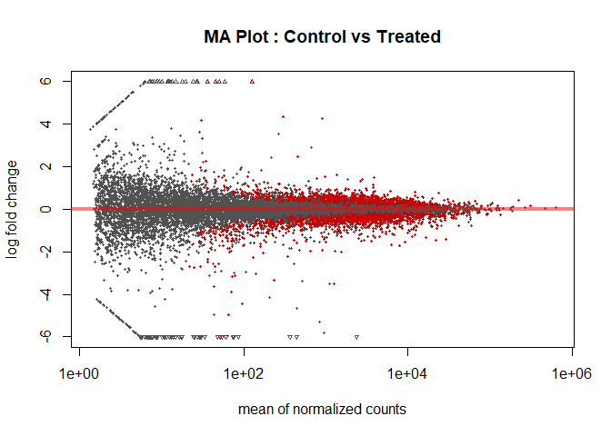

RNA Seq Analysis of PRJNA490376
================
Kieran Bissessar
12/13/2019

# Read in Salmon Data

``` r
library("tximport")

sample_names = c("SRR7819990",
                 "SRR7819991",
                 "SRR7819992",
                 "SRR7819993",
                 "SRR7819994",
                 "SRR7819995")
```

``` r
sample_condition = c(rep('control',3),rep('treated',3))
```

``` r
files = file.path("5_salmon_quant",
                  sample_names,
                  paste(sample_names,".transcripts_quant",sep=""),
                  'quant.sf')

names(files) = sample_names

print(files)
```

    ##                                                        SRR7819990 
    ## "5_salmon_quant/SRR7819990/SRR7819990.transcripts_quant/quant.sf" 
    ##                                                        SRR7819991 
    ## "5_salmon_quant/SRR7819991/SRR7819991.transcripts_quant/quant.sf" 
    ##                                                        SRR7819992 
    ## "5_salmon_quant/SRR7819992/SRR7819992.transcripts_quant/quant.sf" 
    ##                                                        SRR7819993 
    ## "5_salmon_quant/SRR7819993/SRR7819993.transcripts_quant/quant.sf" 
    ##                                                        SRR7819994 
    ## "5_salmon_quant/SRR7819994/SRR7819994.transcripts_quant/quant.sf" 
    ##                                                        SRR7819995 
    ## "5_salmon_quant/SRR7819995/SRR7819995.transcripts_quant/quant.sf"

``` r
tx2gene = read.csv("tx2gene.csv",
                     header=F,
                     sep=",")

tx2gene$V1<- gsub("\\..*","",tx2gene$V1)
tx2gene$V2<- gsub("\\..*","",tx2gene$V2)
head (tx2gene)
```

    ##                V1              V2
    ## 1 ENST00000632684 ENSG00000282431
    ## 2 ENST00000631435 ENSG00000282253
    ## 3 ENST00000448914 ENSG00000228985
    ## 4 ENST00000434970 ENSG00000237235
    ## 5 ENST00000415118 ENSG00000223997
    ## 6 ENST00000604642 ENSG00000270961

``` r
#if (!requireNamespace("BiocManager", quietly = TRUE))
#    install.packages("BiocManager")

#BiocManager::install("tximport")
```

``` r
#print(files)

txi = tximport(files,
               type="salmon",
               tx2gene=tx2gene)
```

    ## reading in files with read_tsv

    ## 1 2 3 4 5 6 
    ## transcripts missing from tx2gene: 2440
    ## summarizing abundance
    ## summarizing counts
    ## summarizing length

``` r
samples = data.frame(sample_names=sample_names,
                     condition=sample_condition)

row.names(samples) = sample_names
```

# Create DESeqDataSet Object

``` r
#if (!requireNamespace("BiocManager", quietly = TRUE))
#    install.packages("BiocManager")

#BiocManager::install("DESeq2")
```

``` r
library("DESeq2")
```

    ## Loading required package: S4Vectors

    ## Loading required package: stats4

    ## Loading required package: BiocGenerics

    ## Loading required package: parallel

    ## 
    ## Attaching package: 'BiocGenerics'

    ## The following objects are masked from 'package:parallel':
    ## 
    ##     clusterApply, clusterApplyLB, clusterCall, clusterEvalQ,
    ##     clusterExport, clusterMap, parApply, parCapply, parLapply,
    ##     parLapplyLB, parRapply, parSapply, parSapplyLB

    ## The following objects are masked from 'package:stats':
    ## 
    ##     IQR, mad, sd, var, xtabs

    ## The following objects are masked from 'package:base':
    ## 
    ##     anyDuplicated, append, as.data.frame, basename, cbind, colnames,
    ##     dirname, do.call, duplicated, eval, evalq, Filter, Find, get, grep,
    ##     grepl, intersect, is.unsorted, lapply, Map, mapply, match, mget,
    ##     order, paste, pmax, pmax.int, pmin, pmin.int, Position, rank,
    ##     rbind, Reduce, rownames, sapply, setdiff, sort, table, tapply,
    ##     union, unique, unsplit, which, which.max, which.min

    ## 
    ## Attaching package: 'S4Vectors'

    ## The following object is masked from 'package:base':
    ## 
    ##     expand.grid

    ## Loading required package: IRanges

    ## 
    ## Attaching package: 'IRanges'

    ## The following object is masked from 'package:grDevices':
    ## 
    ##     windows

    ## Loading required package: GenomicRanges

    ## Loading required package: GenomeInfoDb

    ## Loading required package: SummarizedExperiment

    ## Loading required package: Biobase

    ## Welcome to Bioconductor
    ## 
    ##     Vignettes contain introductory material; view with
    ##     'browseVignettes()'. To cite Bioconductor, see
    ##     'citation("Biobase")', and for packages 'citation("pkgname")'.

    ## Loading required package: DelayedArray

    ## Loading required package: matrixStats

    ## Warning: package 'matrixStats' was built under R version 3.6.3

    ## 
    ## Attaching package: 'matrixStats'

    ## The following objects are masked from 'package:Biobase':
    ## 
    ##     anyMissing, rowMedians

    ## Loading required package: BiocParallel

    ## 
    ## Attaching package: 'DelayedArray'

    ## The following objects are masked from 'package:matrixStats':
    ## 
    ##     colMaxs, colMins, colRanges, rowMaxs, rowMins, rowRanges

    ## The following objects are masked from 'package:base':
    ## 
    ##     aperm, apply, rowsum

``` r
ddsTxi = DESeqDataSetFromTximport(txi,
                                  colData = samples,
                                  design = ~ condition)
```

    ## using counts and average transcript lengths from tximport

``` r
print(ddsTxi)
```

    ## class: DESeqDataSet 
    ## dim: 36629 6 
    ## metadata(1): version
    ## assays(2): counts avgTxLength
    ## rownames(36629): ENSG00000000003 ENSG00000000005 ... ENSG00000288380
    ##   ENSG00000288436
    ## rowData names(0):
    ## colnames(6): SRR7819990 SRR7819991 ... SRR7819994 SRR7819995
    ## colData names(2): sample_names condition

### Filter Data

``` r
keep = rowSums(counts(ddsTxi)) >=10 #temp
ddsTxi = ddsTxi[keep,]
```

# Analyze Samples

``` r
ddsTxi = DESeq(ddsTxi)
```

    ## estimating size factors

    ## using 'avgTxLength' from assays(dds), correcting for library size

    ## estimating dispersions

    ## gene-wise dispersion estimates

    ## mean-dispersion relationship

    ## final dispersion estimates

    ## fitting model and testing

``` r
#heirarchical sample cluster
rld = rlog(ddsTxi)
dists = dist(t(assay(rld)))
plot(hclust(dists))
```

<!-- -->

``` r
#pca
plotPCA(object = rld)
```

<!-- -->

\#Dispersion Plot

``` r
estimateDispersions(ddsTxi, fitType = "mean")
```

    ## found already estimated dispersions, replacing these

    ## gene-wise dispersion estimates

    ## mean-dispersion relationship

    ## final dispersion estimates

    ## class: DESeqDataSet 
    ## dim: 18034 6 
    ## metadata(1): version
    ## assays(6): counts avgTxLength ... H cooks
    ## rownames(18034): ENSG00000000003 ENSG00000000419 ... ENSG00000288380
    ##   ENSG00000288436
    ## rowData names(10): baseMean baseVar ... dispOutlier dispMAP
    ## colnames(6): SRR7819990 SRR7819991 ... SRR7819994 SRR7819995
    ## colData names(2): sample_names condition

``` r
plotDispEsts(object = ddsTxi, 
             main="Mean Dispersion Estimate Plot")
```

<!-- -->

# Shrinking Log Fold Changes Retreived from `Results`

``` r
res = results(ddsTxi, contrast = c('condition',
                                   'control',
                                   'treated'))
write.table(res,file = "DE_Seq2_results_ALL_genes.txt", sep = "\t")
#MA plot Reg
plotMA(res,
       ylim = c(-6,6),
       main = "MA Plot : Control vs Treated")
```

<!-- -->

``` r
res_shrunk = lfcShrink(ddsTxi, contrast = c('condition',
                                            'control',
                                            'treated'))
```

    ## using 'normal' for LFC shrinkage, the Normal prior from Love et al (2014).
    ## 
    ## Note that type='apeglm' and type='ashr' have shown to have less bias than type='normal'.
    ## See ?lfcShrink for more details on shrinkage type, and the DESeq2 vignette.
    ## Reference: https://doi.org/10.1093/bioinformatics/bty895

``` r
#MA plot Shrunk
plotMA(res_shrunk,
       ylim = c(-6,6),
       main = "MA Plot : Control vs Treated Shrunk")
```

<!-- -->

# Order by Adjusted P-value

``` r
res_shrunk = res_shrunk[complete.cases(res_shrunk),] # get rid of NAs

res_shrunk_ordered = res_shrunk[order(res_shrunk$padj),]
```

# Raw P-value Histogram

``` r
library('ggplot2')
```

    ## Warning: package 'ggplot2' was built under R version 3.6.3

``` r
ggplot(as.data.frame(res_shrunk_ordered),aes(pvalue)) + geom_histogram(fill="light blue",color='black')
```

    ## `stat_bin()` using `bins = 30`. Pick better value with `binwidth`.

<!-- -->

# List of 10 most Differentially expressed genes (statistically speaking)

``` r
head(res_shrunk_ordered, n = 10) 
```

    ## log2 fold change (MAP): condition control vs treated 
    ## Wald test p-value: condition control vs treated 
    ## DataFrame with 10 rows and 6 columns
    ##                         baseMean     log2FoldChange              lfcSE
    ##                        <numeric>          <numeric>          <numeric>
    ## ENSG00000163041  7925.2807750077  -1.69005213322698 0.0637441561911091
    ## ENSG00000196396 6477.19649567436  -1.14175512465188 0.0433031995593011
    ## ENSG00000175334 6336.43984126653  -1.61916754973746 0.0658570383450477
    ## ENSG00000206286 2779.40845846847   1.38253745339608  0.058433180816662
    ## ENSG00000128595  21771.695910053  -1.42824475037082 0.0611993737925754
    ## ENSG00000119720  911.86575789695   3.54960197933373  0.151676906695676
    ## ENSG00000117868 12161.4564709006  -1.18098332209562 0.0548427694633696
    ## ENSG00000101384 11456.2571696796  -1.27095896613276 0.0599151705415841
    ## ENSG00000075785 8511.50435706466 -0.899287511509002 0.0438396195111614
    ## ENSG00000105976 9333.59469732736  -1.49972332743962 0.0739240988611648
    ##                              stat                pvalue                  padj
    ##                         <numeric>             <numeric>             <numeric>
    ## ENSG00000163041  -26.507629708261 7.91556389715159e-155 1.14712351997521e-150
    ## ENSG00000196396 -26.3638760349442 3.55843109013999e-153 2.57843916791544e-149
    ## ENSG00000175334 -24.5807289953233 2.03052834599172e-133 9.80880559670402e-130
    ## ENSG00000206286  23.6473340116926 1.25726838395057e-123 4.55508335505293e-120
    ## ENSG00000128595 -23.3365272635837 1.88856964307094e-120 5.47383025347683e-117
    ## ENSG00000119720  23.0879704051421 6.11583875206732e-118 1.47717891991599e-114
    ## ENSG00000117868 -21.5327003860213 7.69185734885256e-103   1.5924342385653e-99
    ## ENSG00000101384 -21.2109866962127 7.56104853945298e-100  1.36968394292191e-96
    ## ENSG00000075785 -20.5121828126567  1.67601454678462e-93  2.69875586800031e-90
    ## ENSG00000105976 -20.2847314859941  1.75418121514145e-91  2.54215941698299e-88

# Differentially Expressed Genes Biologically (Log Fold Change considerations)

``` r
res.shrunk.fdr = res_shrunk_ordered[res_shrunk_ordered$padj<=0.05,]
summary(res.shrunk.fdr)
```

    ## 
    ## out of 3327 with nonzero total read count
    ## adjusted p-value < 0.1
    ## LFC > 0 (up)       : 1560, 47%
    ## LFC < 0 (down)     : 1767, 53%
    ## outliers [1]       : 0, 0%
    ## low counts [2]     : 0, 0%
    ## (mean count < 21)
    ## [1] see 'cooksCutoff' argument of ?results
    ## [2] see 'independentFiltering' argument of ?results

``` r
res.shrunk.fdr.cut_1 = res.shrunk.fdr[res.shrunk.fdr$log2FoldChange>=1,]
res.shrunk.fdr.cut_2 = res.shrunk.fdr[res.shrunk.fdr$log2FoldChange<= -1,]

diff_exp_list = c(row.names(res.shrunk.fdr.cut_1), row.names(res.shrunk.fdr.cut_2)) #list of diff exp genes

summary(diff_exp_list)
```

    ##    Length     Class      Mode 
    ##        63 character character

### Volcano Plot to Visualize Differentially Gene Expression in the Dataset

``` r
par(mar=c(5,5,5,5), cex=1.0, cex.main=1.4, cex.axis=1.4, cex.lab=1.4)

topT1 <- as.data.frame(res_shrunk_ordered)

#Adjusted P values (FDR Q values)
with(topT1, plot(log2FoldChange, -log10(padj), pch=20, main="Control vs Treatment Volcano Plot", cex=1.0, xlab=bquote(~Log[2]~fold~change), ylab=bquote(~-log[10]~Q~value)))

with(subset(topT1, padj<0.05 & abs(log2FoldChange)>1), points(log2FoldChange, -log10(padj), pch=20, col="red", cex=0.5))

#Add lines for absolute FC>2 and P-value cut-off at FDR Q<0.05
abline(v=0, col="black", lty=3, lwd=1.0)
abline(v=-1, col="black", lty=4, lwd=2.0)
abline(v=1, col="black", lty=4, lwd=2.0)
abline(h=-log10(max(topT1$pvalue[topT1$padj<0.05], na.rm=TRUE)), col="black", lty=4, lwd=2.0)
```

<!-- -->

# Gene Clustering

``` r
# normalizedcounts.matrix = counts(ddsTxi,normalized=T)
# diffexp_norm = subset(normalizedcounts.matrix, rownames(normalizedcounts.matrix) %in% diff_exp_list)
# 
# 
# diffexp_norm.cor = cor(t(diffexp_norm), method = "pearson")
# diffexp_norm.dist = as.dist(1 - diffexp_norm.cor)
# diffexp_norm.clust = hclust(diffexp_norm.dist, method = "average")
# plot(diffexp_norm.clust)
```

``` r
# diffexp_norm.clust.groups = cutree(diffexp_norm.clust, k = 2)
# table(diffexp_norm.clust.groups)
# 
# cluster1.1genes = diffexp_norm[diffexp_norm.clust.groups == 1,]
# group1.1=rownames(cluster1.1genes)
# 
# cluster1.2genes = diffexp_norm[diffexp_norm.clust.groups == 2,]
# group1.2=rownames(cluster1.2genes)
```

# Heatmaps

``` r
# library(gplots)
# corfun = function(x){
#   return( as.dist(1-cor(t(x), method = 'pearson')))
# }
# 
# my_palette <- colorRampPalette(c("red","black", "green"), space = "rgb")
# 
# heatmap.2(as.matrix(cluster1.1genes),
#           distfun = corfun,
#           scale="row",
#           Colv = F,
#           dendrogram = "row",
#           trace = "none",
#           main = "Cluster - Group 1 Heat Map",
#           keysize = 1.5,
#           symkey = T,
#           col = my_palette,
#           cexRow=1,
#           cexCol=1,
#           margins = c(7,11),
#           srtCol = 45)
# 
# heatmap.2(as.matrix(cluster1.2genes),
#           distfun = corfun,
#           scale="row",
#           Colv = F,
#           dendrogram = "row",
#           trace = "none",
#           main = "Cluster - Group 2 Heat Map",
#           keysize = 1.5,
#           symkey = T,
#           col = my_palette,
#           cexRow=1,
#           cexCol=1,
#           margins = c(7,11),
#           srtCol = 45)
```

# Gene Ontology Enrichment Analysis

``` r
# library(Category)
# library(annotate)
# library(org.Hs.eg.db)
# library(GOstats)
# library(GO.db)
# 
# g1.1_id = select(org.Hs.eg.db,
#                  columns = "ENTREZID",
#                  keys = group1.1,
#                  keytype = "ENSEMBL")
# 
# g1.2_id = select(org.Hs.eg.db,
#                  columns = "ENTREZID",
#                  keys = group1.2,
#                  keytype = "ENSEMBL")
# 
# ensemble2entre_univ = select(org.Hs.eg.db, 
#                              columns = "ENTREZID", 
#                              keys = rownames(normalizedcounts.matrix),
#                              keytype = "ENSEMBL")
```

``` r
# param1.1 = new("GOHyperGParams",
#              geneIds = g1.1_id$ENTREZID,
#              universeGeneIds = ensemble2entre_univ$ENTREZID,
#              annotation = "org.Hs.eg",
#              ontology = "BP",
#              pvalueCutoff = 0.001,
#              conditional = T,
#              testDirection = "over")
# 
# param1.2 = new("GOHyperGParams",
#              geneIds = g1.2_id$ENTREZID,
#              universeGeneIds = ensemble2entre_univ$ENTREZID,
#              annotation = "org.Hs.eg.db",
#              ontology = "BP",
#              pvalueCutoff = 0.001,
#              conditional = T,
#              testDirection = "over")
```

``` r
# overRepresented1.1 = hyperGTest(param1.1)
# overRepresented1.2 = hyperGTest(param1.2)
# 
# summ1.1 = summary(overRepresented1.1)
# summ1.2 = summary(overRepresented1.2)
```

``` r
# head(summ1.1, n=20)
# head(summ1.2, n=20)
```

``` r
# head(summ1.1$Term, n=20)
# head(summ1.2$Term, n=20)
```
